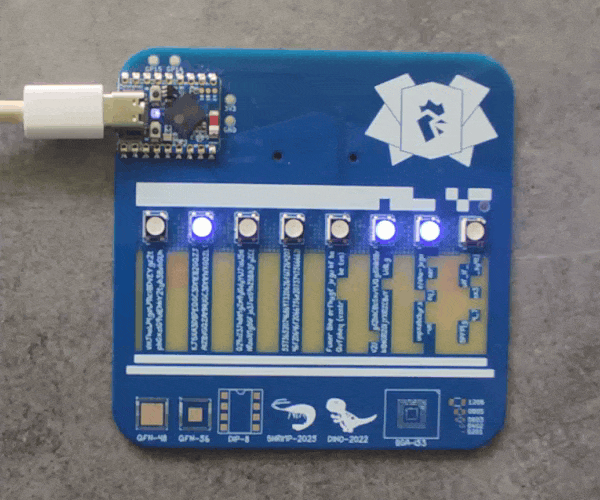

# FCSC 2026 ASCII Badge

Votre ami a configuré [son badge Hackropole](https://github.com/FCSC-FR/hackropole-badge/tree/61d627868d038e7277b8fd4fc4294c639a5fc889) pour encoder un flag sur les 8 LED. Profitant qu’il ait le dos tourné, vous dumpez sauvagement le micrologiciel de sa carte.

*Saurez-vous retrouver le flag à partir du dump ?*

**Note** : posséder le badge n’aide pas à la résolution de l’épreuve, et le micrologiciel original n’a pas été modifié.

Auteur : erdnaxe

Origine : [ASCII Badge](https://hackropole.fr/fr/challenges/hardware/fcsc2026-hardware-ascii-badge/)

## Challenge
[files/badge-dump.img.gz](files/badge-dump.img.gz)

-----------

## Installation manuel
Vous n'utilisez pas l'application **les CTFs de Cyrhades** ? C'est dommage !
Mais voici comment installer ce CTF manuellement :

> git clone https://github.com/Hack-Oeil/fcsc2026-hardware-ascii-badge.git

> cd fcsc2026-hardware-ascii-badge

-----------

## Sur le site officiel hackropole.fr
> https://hackropole.fr/fr/challenges/hardware/fcsc2026-hardware-ascii-badge/
